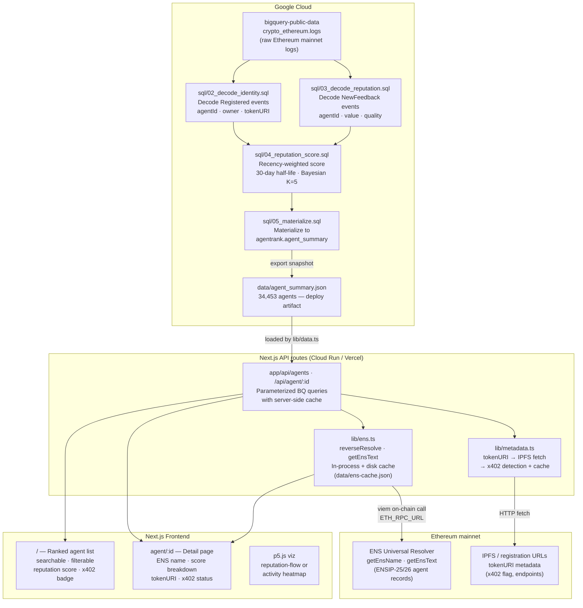

# AgentDex

**ERC-8004 Agent Economy Explorer** — a BigQuery-powered reputation explorer
for on-chain AI agents, built for ETHGlobal NY 2026.

AgentDex decodes every `Registered` and `NewFeedback` event from the official
ERC-8004 mainnet registries, computes a recency-weighted reputation score for
each agent in SQL, and surfaces the ranked list in a searchable Next.js
frontend with real ENS name resolution and x402 payment detection.

---

## Bounty targets

| Bounty | Sponsor | Value |
|---|---|---|
| Best On-Chain Agent Economy Application | Google Cloud | $5,000 |
| Integrate ENS (pool) | ENS | $6,000 split |

---

## Architecture



### Data flow summary

1. **BigQuery** scans `bigquery-public-data.crypto_ethereum.logs`, filtering to
   the two ERC-8004 mainnet registry addresses, and decodes events by
   keccak256 topic hash.
2. `sql/04_reputation_score.sql` computes a recency-weighted, Bayesian-shrunk
   score (0–100) per agent; unrated agents default to 50.0.
3. `sql/05_materialize.sql` writes `agentrank.agent_summary` and exports the
   snapshot to `data/agent_summary.json` (the deploy artifact).
4. Next.js API routes serve the snapshot with server-side cache — judges never
   hit a cold 30-second BigQuery scan.
5. `lib/ens.ts` reverse-resolves owner addresses to ENS names via viem on each
   agent detail request; results cached 24 h in-process and on disk.
6. `lib/metadata.ts` fetches tokenURIs to detect `x402` payment support.

---

## Data provenance

| Metric | Value |
|---|---|
| Total agents | 34,453 |
| Agents with feedback | 1,652 |
| Agents with tokenURI | 16,711 |
| Feedback events (NewFeedback) | 3,173 |
| Revocation events | 0 (never fired on mainnet) |
| First on-chain activity | 2026-01-29 |
| Snapshot computed | 2026-06-13 |

**Official EF ERC-8004 mainnet registry addresses** (verified against
`bigquery-public-data.crypto_ethereum.logs`):

| Registry | Address |
|---|---|
| IdentityRegistry (ERC-721) | `0x8004A169FB4a3325136EB29fA0ceB6D2e539a432` |
| ReputationRegistry | `0x8004BAa17C55a88189AE136b182e5fdA19dE9b63` |

The `0x8004A818…` / `0x8004B663…` addresses are Sepolia testnet — **not used**.

---

## Reputation score formula

Per feedback event *i*:

```
q_i   = clamp(value_i / 10^decimals_i / 100, 0, 1)   # normalised quality 0..1
w_i   = 0.5 ^ (age_days_i / 30)                       # 30-day half-life recency weight

wq    = Σ(w_i · q_i) / Σ(w_i)                         # recency-weighted quality
eff_n = Σ(w_i)                                         # effective feedback volume
conf  = eff_n / (eff_n + 5)                            # Bayesian confidence (K=5)
score = 100 × (conf × wq + (1 − conf) × 0.5)          # 0..100
```

Unrated agents score exactly **50.0** (neutral prior). Scores decay with
wall-clock time — daily refresh keeps rankings current.

---

## ENS integration

`lib/ens.ts` performs real on-chain ENS resolution via viem:

- **Reverse resolve**: `reverseResolve(address)` calls the ENS Universal
  Resolver (`getEnsName`) to map an owner address to its primary ENS name.
- **Text records**: `getEnsText(name, key)` reads any text record. Keys
  supported include:
  - **ENSIP-25**: `agent-registration[<erc7930-registry>][<agentId>]` —
    owner's attestation linking their ENS name to a specific agent registration.
  - **ENSIP-26**: `agent-context`, `agent-endpoint[mcp]`,
    `agent-endpoint[a2a]`, `agent-endpoint[web]` — AI agent identity/endpoints.
  - **Common**: `avatar`, `url`, `description`, `com.twitter`, `com.github`.
- **Batch warm**: `scripts/ens-warm.mjs` pre-resolves the top 200 owner
  addresses into `data/ens-cache.json` so the UI is instant.
- Results cached 24 h in-process (lib/cache singleton) and on disk.

ENS values are **never hard-coded** — every name shown in the UI is the result
of a live `eth_call` to the ENS Universal Resolver. Resolution degrades
gracefully: addresses without a primary name display as the raw hex address.

Configure the RPC endpoint via `ETH_RPC_URL` (default: `https://eth.llamarpc.com`).

---

## Validation Registry

The ERC-8004 Validation Registry (a third contract in the spec) is **under
active revision** as of June 2026. No finalized address is deployed on mainnet.
AgentDex performs best-effort decode if an address becomes available, but does
not depend on it for ranking. The reputation score is derived entirely from
`NewFeedback` events on the deployed `ReputationRegistry`.

---

## Setup

### Prerequisites

- Node.js 20+
- A Google Cloud project with BigQuery API enabled
- A service account with `bigquery.dataViewer` + `bigquery.jobUser` roles
- An Ethereum mainnet RPC endpoint (Alchemy, Infura, LlamaRPC, etc.)

### Install

```bash
git clone https://github.com/zambrose/agentrank
cd agentrank
npm install
```

### Configure credentials

```bash
# GCP service account key (JSON)
export GOOGLE_APPLICATION_CREDENTIALS=/path/to/sa.json

# Ethereum mainnet RPC (optional — defaults to https://eth.llamarpc.com)
export ETH_RPC_URL=https://eth-mainnet.g.alchemy.com/v2/YOUR_KEY
```

### Run locally

```bash
npm run dev       # Next.js dev server on :3000
```

The app loads `data/agent_summary.json` (live snapshot, 34,453 agents).
If missing, it falls back to `shared/fixtures/agents.json` (top 50 by rank).

### Refresh BigQuery data

```bash
# Materialize agent_summary from raw mainnet logs (~352 GB scan)
npm run materialize
```

Requires `GOOGLE_APPLICATION_CREDENTIALS` pointing to a key with
`bigquery.dataViewer` on `bigquery-public-data` and `bigquery.dataEditor`
on your project.

### Warm ENS cache

```bash
# Resolve top 200 owner addresses → data/ens-cache.json
node scripts/ens-warm.mjs

# Options
node scripts/ens-warm.mjs --top 500 --concurrency 3
ETH_RPC_URL=https://... node scripts/ens-warm.mjs
```

---

## Project structure

```
agentrank/
├── app/                  Next.js App Router pages + API routes
│   ├── page.tsx          Ranked agent list (search · filter · p5 viz)
│   └── agent/[id]/       Agent detail (ENS name · score · x402 · tokenURI)
├── lib/
│   ├── cache.ts          In-process TTL cache (shared singleton)
│   ├── data.ts           Load agent_summary.json or fixtures
│   └── ens.ts            ENS resolution via viem (ENSIP-25/26)
├── scripts/
│   ├── bq.mjs            BigQuery CLI runner
│   ├── ens-warm.mjs      Pre-warm ENS cache for top owners
│   └── materialize.mjs   Export BQ snapshot → data/agent_summary.json
├── shared/
│   ├── schema.ts         LOCKED AgentSummary TypeScript type
│   ├── SCHEMA.md         Column-level documentation + formula
│   └── fixtures/         Top-50 agents (committed fallback)
├── sql/
│   ├── 01_topics.sql     ERC-8004 keccak256 topic hashes (validated)
│   ├── 02_decode_identity.sql   Decode Registered / URIUpdated
│   ├── 03_decode_reputation.sql Decode NewFeedback / FeedbackRevoked
│   ├── 04_reputation_score.sql  Recency-weighted score computation
│   └── 05_materialize.sql       Write agent_summary table + export
└── data/
    ├── agent_summary.json        Live snapshot (deploy artifact, 34,453 agents)
    └── ens-cache.json            Runtime ENS cache (gitignored, regenerable)
```

---

## Acceptance criteria checklist

- [x] BigQuery is the core query layer over raw mainnet ERC-8004 data
- [x] Official EF ERC-8004 registry addresses used
  (`0x8004A169…` / `0x8004BAa1…`)
- [ ] Frontend + BigQuery backend deployed at a public URL
- [x] Reputation ranking + at least one filter/search flow works live
- [x] x402-payable agents flagged (populated by tokenURI metadata fetcher)
- [x] Real ENS resolution — `lib/ens.ts` uses viem `getEnsName` / `getEnsText`
      against Ethereum mainnet; never hard-coded
- [x] Public repo, README with architecture diagram (Mermaid above)

---

## Reference

- ERC-8004 contracts + spec: https://github.com/erc-8004/erc-8004-contracts
- BigQuery public datasets: https://docs.cloud.google.com/blockchain-analytics/docs/supported-datasets
- ENS documentation: https://docs.ens.domains
- ENSIP-25 (agent registration records): https://docs.ens.domains/ensip/25/
- ENSIP-26 (agent context + endpoint records): https://docs.ens.domains/ensip/26/
- x402 payment protocol: https://x402.org
